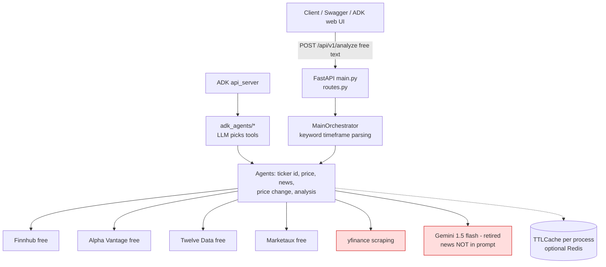
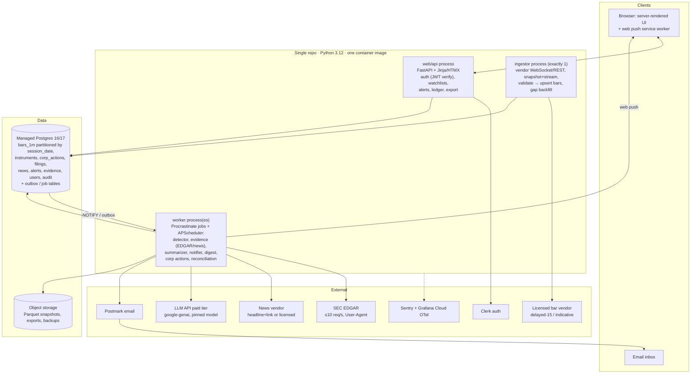

# 05 — Target Architecture

← [Index](README.md) · Previous: [04 Real-time data strategy](04-real-time-data-strategy.md) · Next: [06 Quantitative validation](06-quantitative-validation.md)

**Principle:** use the simplest architecture that meets [04](04-real-time-data-strategy.md) and [07](07-security-and-production-readiness.md) for a team of 1–2 engineers. That is **one Python codebase, one Postgres, and three process types**. §8 defines the conditions for adding anything more.

Tool evidence: [research/infrastructure.md](research/infrastructure.md), accessed 2026-09-24. Decision record: [ADR-003](adr/ADR-003-modular-monolith-postgres.md).

---

## 1. Current architecture (as-is)



Per request, it is stateless. There is no database, no scheduler and no streaming. All data is fetched on demand from free tiers that are not licensed for display ([01](01-repository-assessment.md)).

## 2. Proposed architecture (to-be)



### Service boundaries (modules in one codebase)

| Module | Responsibility | Key rules |
|---|---|---|
| `domain/` | Instruments, bars, corporate actions, alerts, evidence (pydantic models + SQLAlchemy 2 mappings) | Timestamps are tz-aware. Entitlement is an enum. No `Optional` used to mean "unknown source". |
| `marketdata/` | Vendor adapters behind a `BarSource` protocol; validation (pandera schema + range checks); quarantine | Typed errors, not `None`/`[]`. One adapter per licensed vendor. Dev-only adapters are flagged `internal_only=True` and refused in production config. |
| `calendar/` | `exchange_calendars` XNYS plus a `session_overrides` table (23/5 overnight session, ad-hoc closures) | Bars are keyed by **trading-session date**, not UTC date ([research §0](research/infrastructure.md)). |
| `detector/` | Abnormal return, z-score, RVOL, rules, calibration params | Deterministic. Versioned. Pure functions over arrays plus a thin DB layer. |
| `evidence/` | EDGAR poller and parser, news ingest, earnings calendar, ledger assembly with before/during/after labels | Acceptance and publication timestamps are required. |
| `summarizer/` | Grounded LLM call, JSON schema, hard gates, fallback | [ADR-004](adr/ADR-004-llm-role-grounded-only.md). Provider-agnostic interface. |
| `notify/` | Email and web push with idempotency keys and a delivery log | Retries with a deadline. Never duplicates a notification. |
| `web/` | FastAPI routes, Jinja/HTMX templates, CSRF, auth dependency | Generic errors with a correlation ID. Row-level security (RLS) plus service-layer scoping. |
| `ops/` | Freshness monitor, reconciliation, admin views, health endpoints | `/health/live` and `/health/ready` check the DB, feed age and job lag. |

## 3. Real-time data flow

```mermaid
sequenceDiagram
  autonumber
  participant V as Bar vendor (delayed/indicative)
  participant I as ingestor
  participant DB as Postgres
  participant W as worker: detector
  participant EV as worker: evidence
  participant S as worker: summarizer
  participant N as worker: notifier
  participant U as User
  V->>I: 1-min bar (event_ts, provider_ts)
  I->>I: validate (OHLC sanity, range vs prev close, entitlement)
  alt invalid
    I->>DB: quarantine + incident event
  else valid
    I->>DB: UPSERT bars_1m (natural key) + ingest_ts; INSERT outbox(bar_batch)
    DB-->>W: NOTIFY (wake-up; outbox is source of truth)
    W->>DB: load window + estimation params (cached per day)
    W->>W: AR, z, RVOL; rule eval; alert key = hash(instrument, detector_ver, window, rule)
    W->>DB: INSERT alert ON CONFLICT DO NOTHING (+ process_ts)
    W->>EV: job(alert_id)
    EV->>DB: filings/news/earnings in [move_start − lookback, move_start + grace]
    EV->>DB: evidence_links with before/during/after labels
    EV->>S: job(alert_id) (skipped if evidence-degraded)
    S->>S: LLM(JSON schema) → hard gates (citations exist, numbers match, timestamps, no advice)
    S->>DB: summary or abstention (+ model id, prompt ver)
    S->>N: job(alert_id)
    N->>U: email / web push (idempotency key) — display_ts logged
  end
  Note over I,DB: Gap detected → REST backfill; backfilled alerts archive-only (no push if >10 min old)
  Note over EV: Separately, EDGAR poller runs every 30–60 s and stores filings independent of alerts
```

## 4. Storage, caching and background work

- **Postgres is the system of record for everything.**
  - `bars_1m` uses native range partitioning by `session_date`, monthly. Sizing is about 585M rows for 3,000 symbols over 2 years of regular hours ([research §1](research/infrastructure.md)).
  - Keep 2 years hot. Older data goes to Parquet in object storage, where licence retention allows it.
- **No Redis in the MVP.**
  - Caching uses in-process LRU for reference data (instruments, calendar, per-day estimation parameters). Keys are deterministic, which fixes [01 finding 15](01-repository-assessment.md#43-high--reliability-and-performance).
  - Rate limiting is Postgres-backed or edge-level.
  - Redis/Valkey is added only on the §8 triggers. Redis 8 is AGPL/RSAL/SSPL tri-licensed; Valkey is BSD ([research §2](research/infrastructure.md)).
- **Jobs.** The transactional outbox is the source of truth, and `LISTEN/NOTIFY` is only a wake-up signal. A listener disconnected at commit misses the notification, so workers also poll the outbox every few seconds. Job execution uses Procrastinate (Postgres-based). Periodic tasks use APScheduler 3.11; 4.x is still pre-release.
- **Research and backtesting workloads.** Run offline in notebooks or scripts over Parquet snapshots with DuckDB. They never query the production primary. Replay uses the same `detector/` code, so production and research cannot drift apart.

## 5. Frontend and UX

- The UI is server-rendered with FastAPI, Jinja and HTMX, plus a small service worker for web push.
  - **Rationale:** one language for a 1–2 person team, and accessible HTML by default.
  - **Revisit:** move to a React/TypeScript SPA only if interaction complexity grows beyond forms, lists and a ledger view. Charting and drag-and-drop dashboards are the likely triggers.
- Every price widget shows the source badge, the entitlement label and "as of" ([04 §5](04-real-time-data-strategy.md#5-freshness-and-degraded-mode-semantics)). A global status banner reflects the degraded mode.
- The alert ledger view is a timeline around the move. Market, sector and residual context is at the top. Evidence items are placed on the timeline relative to `move_start`, marked before, during or after. The summary appears with citation chips, or the text "No company-specific catalyst found".
- Accessibility target is WCAG 2.2 AA. Don't rely on colour alone for up/down or freshness; use icons and text.
- iOS web push only works once the site is added to the Home Screen ([research §10](research/infrastructure.md)). Email is the default channel.

## 6. Auth, security, secrets

Summary; details are in [07 §2](07-security-and-production-readiness.md#2-security-architecture-target).

- **Auth:** Clerk free tier (≤ 50k monthly retained users). FastAPI verifies JWTs through JWKS. The internal `user_id` maps to `clerk_user_id` to limit lock-in.
- **Isolation:** Postgres RLS on user tables, plus service-layer scoping.
- **Secrets:** platform secret store per environment. Paid LLM tier only.
- **Audit:** `audit_log` table, append-only.

## 7. Environments, CI/CD, deployment, recovery

| Topic | Decision |
|---|---|
| Environments | `dev` (local + replay feed), `staging` (licensed pilot feed in shadow mode), `prod` |
| Hosting | Fly.io (iad) or Render/Railway, all region US-East, near vendors and the SEC. **Not Cloud Run for the ingestor:** it caps websockets at 60 minutes. AWS App Runner closed to new customers on 2026-04-30 ([research §8](research/infrastructure.md)). |
| Database | Managed Postgres (Fly MPG, Render, Neon or RDS). None of these offer Timescale compression or continuous aggregates. When needed, move to Tiger Cloud (~$30+/mo), or self-host Timescale with pgBackRest ([ADR-003](adr/ADR-003-modular-monolith-postgres.md)). |
| CI | GitHub Actions: ruff, mypy, pytest (unit + golden + property), `pip-audit`, container build and scan, axe on templates, alembic upgrade/downgrade on an ephemeral Postgres |
| CD | Merge to `main` deploys to staging automatically. Production deploy is manual, outside market hours unless it is a hotfix. The `web` process uses rolling deploys with health checks. The **ingestor deploys stop-before-start**, and holds a Postgres advisory lock so two instances never hold the vendor's single WebSocket slot. |
| Migrations | Alembic, expand/contract only, run as a release step. Take a backup before any destructive contraction. |
| Rollback | Redeploy the previous image. Schema stays backward-compatible for one release. |
| Backups | Managed PITR (7–14 days), plus a nightly logical dump to object storage (35 days). Quarterly restore drill. |
| Observability | structlog JSON logs; Sentry (errors, cron monitors); OpenTelemetry to Grafana Cloud (free tier: 10k series). A market-hours-aware "age of last bar" alert and a heartbeat, because HTTP uptime checks don't catch a stalled feed. |
| Cost controls | Per-provider request budgets. An LLM token budget per day with a hard cap (summaries off when it's hit). Alerts on spend anomalies. Parquet archiving. |

## 8. When to add infrastructure

| Add | Trigger (measured) |
|---|---|
| TimescaleDB (compression, continuous aggregates) | `bars_1m` over ~50 GB or 100–200M rows, **or** extended/overnight hours ingested for more than 1,000 symbols, **or** p95 of window queries over 200 ms |
| Separate detector processes and a queue (Redis Streams or NATS JetStream) | More than a few hundred events per second, **or** detector lag p95 above target at the open |
| ClickHouse / QuestDB | Tick-level (trade-by-trade) storage becomes a requirement. It is not in the plan. |
| Redis/Valkey | Multiple web instances need shared rate limits or sessions beyond what Postgres handles, or pub/sub for live browser updates |
| SPA frontend | UX research shows a need for interactive charts or dashboards |
| Kubernetes | Not foreseen. Reconsider only beyond about 10 services or a multi-region requirement. |

## 9. Future execution separation (not in MVP)

If paper or live trading is ever pursued (it is excluded by [02 §5](02-product-thesis.md#5-explicit-mvp-exclusions)):

- **Separation.** Use three separate deployables and credentials for research (read-only data), paper trading (broker sandbox, e.g. Alpaca paper via OAuth) and live trading. Live trading runs in a separate service and database schema, with its own secrets, and has no code path from the alert or LLM modules to order placement.
- **Controls before any live order:**
  - pre-trade validation: symbol tradable, price bands, max notional per order and per day, max position, short-sale checks;
  - a per-account kill switch and a global kill switch;
  - idempotent client order IDs;
  - reconciliation of orders, fills and positions against the broker every minute and at end of day;
  - an audit trail of every decision input.
- **Approvals.**
  - A regulatory determination (broker-dealer or RIA status, or a regulated partner).
  - A broker partnership: IBKR OAuth is limited to licensed organisations or approved vendors; Schwab requires commercial review; Tradier OAuth is partner-only ([research §9](research/infrastructure.md)).
  - Months of paper-trading evidence meeting the [06 §7](06-quantitative-validation.md#7-evidence-required-before-later-features-ship) standards.
  - An external security review, and insurance.

## 10. Keep / refactor / replace / retire

This summarises [01 §6](01-repository-assessment.md#6-reuse-vs-redesign).

| Existing | Fate | Where it goes |
|---|---|---|
| FastAPI app, pydantic | Keep and refactor | `web/`, `domain/` |
| Adapter pattern | Refactor | `marketdata/` (typed, entitlement-aware) |
| Free-tier adapters (Finnhub, Alpha Vantage, Twelve Data, Marketaux) | Dev-only | `marketdata/dev/`, refused in prod config |
| yfinance | Retire from product | Local notebooks only |
| Gemini adapter and prompts | Replace | `summarizer/` on `google-genai` |
| Cache util | Replace | Deterministic in-process caches; Postgres |
| Orchestrator and ADK | Retire | [ADR-005](adr/ADR-005-retire-adk-and-nl-orchestrator.md) |
| News dedup idea | Refactor | `evidence/` |
