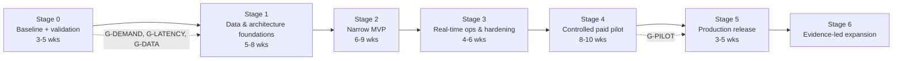

# 08 — Implementation Roadmap

← [Index](README.md) · Previous: [07 Security & readiness](07-security-and-production-readiness.md) · Next: [09 Costs](09-costs-and-operating-model.md)

**Staffing assumption:** 1 full-time senior Python engineer, about 0.3 FTE for frontend/design, and the owner as product lead. They are supported by legal counsel (hourly) and a part-time second engineer from Stage 2. Effort figures are **engineer-weeks (ew) given as ranges**. They are estimates, not commitments. Costs come from [09](09-costs-and-operating-model.md).

Component names (`api`, `ingestor`, `detector`, `evidence`, `summarizer`, `notifier`, `web`, `db`) refer to [05](05-target-architecture.md).

---

## Stage map and critical path

**Critical path:**
1. Vendor display-rights confirmation (G-DATA).
2. The bar-ingestion and storage schema.
3. The detector with calibration.
4. The evidence ledger (EDGAR).
5. Summarizer evaluation (the gold set takes calendar time for labelling).
6. The shadow run of 10 trading days.
7. The pilot.

Vendor contracting and interviews run **in parallel** with Stage 0–1 engineering.

**Quick wins (≤ 1 day each, Stage 0):**
- Rotate the keys.
- Fix the `self.logger` startup crash.
- Delete the fabricated-data method.
- Stop leaking exception text.
- Pass news into the prompt so the prototype stops inventing causes.
- Remove the wildcard CORS with credentials.
- Pin dependencies.

## First ten implementation tasks

| ID | Task | Stage | Effort | Depends on | Acceptance criteria |
|---|---|---|---|---|---|
| **T-01** | Security baseline. Owner rotates or revokes the 4 leaked keys and enables secret scanning and push protection. Add `.env.example` with placeholder values. Decide on purging history (ADR) | 0 | 0.5 d dev + owner | — | Old keys revoked in provider dashboards. Scanning on. `.env.example` committed. ADR recorded |
| **T-02** | Tooling baseline. `pyproject.toml` with `uv` lock (hash-pinned), ruff, mypy (strict on new packages), pytest config. GitHub Actions CI running lint, type check, tests and `pip-audit`. Python 3.12 pinned | 0 | 2–3 d | — | CI green on `main`. `CLAUDE.md` commands updated to the real ones. `uv sync` reproduces the environment |
| **T-03** | Characterisation tests for the prototype. Port the offline harness from the assessment. Regression tests for: startup without optional keys; news-merge TypeError; news missing from the prompt; error leakage | 0 | 2–3 d | T-02 | Tests encode *current* behaviour. Failing tests are marked `xfail` with links to the findings in [01](01-repository-assessment.md) |
| **T-04** | Prototype quick fixes: the items in "quick wins" above. Remove yfinance from default fallbacks | 0 | 2–3 d | T-03 | The T-03 xfails for these findings now pass. The app starts with only `GOOGLE_API_KEY` set |
| **T-05** | Customer discovery: 12–15 interviews, a diary study, and the H2/H3 blind ledger test built from 20 historical alerts made by hand ([02 §6](02-product-thesis.md#6-product-hypotheses-and-how-to-validate-them)) | 0 | Owner 3–4 wks (parallel) | — | Interview notes and a synthesis doc. H1–H4 scored against thresholds |
| **T-06** | Data vendor due diligence against the [06 §1 data spec](06-quantitative-validation.md#required-data-specification-for-the-intraday-detector): consolidated, full-volume, 1-minute OHLCV, 15-min delayed allowed, displayable. Get written answers on display rights to paying users, storage and derived data, **user exports and republication by subscribers**, exchange fees, vendor-of-record status, and professional-user handling. Candidates: Massive Full Market Delayed (base-plan question), Twelve Data Venture, Intrinio Enterprise (SIP-delayed), Databento `EQUS.SUMMARY`/Mini, Intrinio Startup as the partial-venue fallback; Benzinga for news ([11](11-evidence-and-open-questions.md)) | 0 | Owner 2–4 wks (parallel) | — | Written confirmation that a configuration **meeting the spec** costs ≤ ~$3,000/mo, or a documented decision to use the fallback mode. Export rights answered. ADR-002 accepted |
| **T-07** | Domain model and migrations. Tables for instruments (FIGI, CIK, ticker history), bars_1m with source, entitlement and the 5 timestamps, corporate_actions (versioned), filings, news_items, alerts, evidence_links, users, watchlists and audit_log. Alembic expand/contract | 1 | 1.5–2 wks | T-02 | Migrations run up and down on a fresh DB. Constraints enforce tz-aware timestamps and non-null entitlement. Row-level security on user tables, with tests |
| **T-08** | Time and calendar module: the `exchange_calendars` XNYS wrapper, session minute index, half-days, DST, halt state | 1 | 3–5 d | T-02 | Tests pin the 2026–27 holidays and half-days, both DST Mondays, and the minute-of-session mapping |
| **T-09** | Ingestion framework and first bar adapter. Uses a dev-tier vendor, internal only. Snapshot plus stream or poll, idempotent upsert, gap detection and backfill, a quarantine for validation failures, per-provider budget, typed errors. Adds a replay source that reads stored Parquet | 1 | 2–3 wks | T-07, T-08 | Replaying a recorded day gives identical DB state on re-run. Injected duplicates, reordering and gaps are handled per [07 §5](07-security-and-production-readiness.md#5-failure-scenarios-each-needs-a-runbook-and-a-drill) |
| **T-10** | Detector v1: market-model AR, standardised z, time-of-day RVOL, price-level rules, deterministic alert keys. Includes the golden-fixture and property test suite | 1–2 | 2–3 wks | T-09 | All [06 §4](06-quantitative-validation.md#4-alert-engine-validation-mvp) fixture days pass. Detector p95 < 5 s for 3,000 symbols per minute on the dev machine |

## Stages

### Stage 0 — Baseline verification and product validation (3–5 weeks)

- **User-facing outcome:** none new. The prototype stops being unsafe or misleading.
- **Tasks:** T-01 … T-06, and a counsel intake (publisher's exclusion; entity and jurisdiction).
- **Affected components:** `src/adapters/*`, `src/utils/cache.py`, `main.py`, `routes.py`, `.gitignore`, CI.
- **Acceptance:** CI is green. The quick-win findings are closed. The interview synthesis is done. A vendor answer is in hand.
- **Evidence:** CI logs, the interview report, vendor emails.
- **Risks:** interviews invalidate H1; the vendor does not reply.
- **Effort:** about 2 ew of engineering, plus owner time.
- **Cost:** about $0–50/mo data and about $20 LLM.

### Stage 1 — Data and architecture foundations (5–8 weeks)

- **User-facing outcome:** internal replay dashboard only.
- **Tasks:**
  - T-07 … T-10.
  - T-11: EDGAR poller and filings parser (8-K items, Forms 4, 10-Q/K, SC 13D/G) with acceptance timestamps.
  - T-12: corporate-actions table and adjustment service, with golden tests.
  - T-13: instrument master (OpenFIGI mapping; ticker-change history).
  - T-14: observability skeleton (OpenTelemetry, structured logs, freshness metrics).
  - T-15: historical data backfill of 2 years of minute bars for the pilot universe (licence permitting) and snapshot manifests.
- **Components:** new `ingestor`, `detector`, `evidence`, `db`. The legacy `src/` is untouched except for shared utilities.
- **Acceptance:** replay of 12 months runs end to end. The calibration report achieves a target alert rate ([06 §4](06-quantitative-validation.md#4-alert-engine-validation-mvp)).
- **Evidence:** the calibration report and G2 test report.
- **Risks:** history licence limits; corporate-action quality.
- **Decisions:** Timescale vs. plain Postgres ([ADR-003](adr/ADR-003-modular-monolith-postgres.md)).
- **Effort:** 7–10 ew.
- **Cost:** dev data about $50–250/mo if a paid dev tier is needed for history; infrastructure about $50–100/mo.

**Quick-response track (runs alongside Stage 1–3).** Tasks Q-01 to Q-06 in [13 §6](13-quick-response-system.md#6-quick-response-track-tasks):

| Task | Scope |
|---|---|
| Q-01 | Latency harness |
| Q-02 | EDGAR fast poller |
| Q-03 | Tier-A ingest benchmark |
| Q-04 | Zen/CEL decision layer, replayable |
| Q-05 | L2 bake-off (Jev vs. LLM vs. local classifier) |
| Q-06 | SSE fan-out |

Q-01, Q-02 and Q-04 are on the critical path for the detector (T-10) and the evidence ledger (T-19). The others are optional for the pilot.

### Stage 2 — A complete, narrow MVP (6–9 weeks)

- **User-facing outcome:** the five workflows in [02 §4](02-product-thesis.md#core-workflows-mvp), on staging, with invited testers.
- **Tasks:**
  - T-16: auth and user model.
  - T-17: watchlist CRUD and import.
  - T-18: alert rules and preferences.
  - T-19: evidence ledger assembly with before/during/after labelling.
  - T-20: summarizer on `google-genai` with a pinned model, JSON schema and hard gates ([ADR-004](adr/ADR-004-llm-role-grounded-only.md)).
  - T-21: gold set of about 800 cases, and the evaluation harness.
  - T-22: `notifier` (email plus web push), with idempotency.
  - T-23: `web` UI (watchlists, alert feed, ledger view, digest, export, entitlement and freshness badges, status banner).
  - T-24: daily digest job.
  - T-25: export (Markdown/CSV) and archive search.
  - T-26: feedback capture.
  - T-27: delete the ADK and free-text orchestrator ([ADR-005](adr/ADR-005-retire-adk-and-nl-orchestrator.md)).
- **Acceptance:** G1, G2 and G4 met on staging. Accessibility check (axe) passes.
- **Risks:** gold-set labelling throughput (budget about 60–80 annotator hours); UI scope creep.
- **Effort:** 10–14 ew, plus annotation.

### Stage 3 — Real-time operation and hardening (4–6 weeks)

- **User-facing outcome:** staging runs live on the **pilot vendor feed**, with freshness labels and degraded modes.
- **Tasks:**
  - T-28: pilot vendor adapter under the signed licence.
  - T-29: degraded-mode state machine and status banner.
  - T-30: reconciliation job.
  - T-31: SLO dashboards and alerting.
  - T-32: failure drills.
  - T-33: load test at 2× pilot.
  - T-34: backup and restore drill.
  - T-35: runbooks.
  - T-36: security review and fixes; tenant-isolation tests.
- **Acceptance:** a **10-trading-day shadow run** meets the freshness and latency SLOs (G3, G5, G7, and G6 except the pentest).
- **Evidence:** dashboard exports and drill logs.
- **Risks:** vendor stream instability; clock issues.
- **Effort:** 6–9 ew.
- **Cost:** pilot data starts, about $500–3,000/mo depending on the T-06 outcome.

### Stage 4 — Controlled paid pilot (8–10 weeks)

- **User-facing outcome:** 20–50 invited paying users (goal ≥ 10 paying at ≥ $39/mo). Onboarding includes a non-professional attestation.
- **Tasks:**
  - Billing (Stripe).
  - Terms of Service and Privacy Policy.
  - Counsel memo finalised.
  - Weekly human audit of 50 alerts.
  - Calibration updates from feedback.
  - A support inbox.
  - A status page.
- **Acceptance:** H5–H7 measured. SLOs are met in ≥ 95% of pilot trading days. No SEV1 left unresolved for more than 1 trading day.
- **Evidence:** a pilot report covering usage, retention, alert usefulness, eval drift and cost per user.
- **Effort:** 4–6 ew of engineering (fixes), plus product time.

### Stage 5 — Production release (3–5 weeks)

- **User-facing outcome:** public sign-up (US users).
- **Tasks:**
  - External pentest.
  - G8 usability test.
  - G10 contracts at production scale.
  - Autoscaling review.
  - On-call rota.
  - Incident process rehearsed.
  - Pricing page.
  - Re-price the real-time upsell against the CT Plan (the DataCT agreement is due by 2027-03-01 if real-time is offered).
- **Acceptance:** all gates G1–G10 met with linked evidence (`/readiness-review`).
- **Effort:** 4–6 ew.

### Stage 6 — Later expansion (only with evidence)

Candidates, each with its own entry criterion:

| Candidate | Entry criterion |
|---|---|
| Real-time upsell tier (Cboe One or Nasdaq Basic) | ≥ 150 paying users and ≥ 40% say they would pay more |
| Team or advisor tier (shared watchlists, client-ready exports) | ≥ 20% of users are multi-seat prospects |
| Q&A over the event archive | The evaluation framework extended and passing |
| Impersonal watchlist exposure views (sector or factor mix) | Counsel sign-off that this stays impersonal |
| Backtesting of alert rules | Only under the [06 §7](06-quantitative-validation.md#7-evidence-required-before-later-features-ship) evidence standards |

Bonds, options and non-US markets each need a separate thesis.

## Stop/go gates

| Gate | When | Go if | Otherwise |
|---|---|---|---|
| **G-DEMAND** | End of Stage 0 | H1 ≥ 60% weekly pain and H2 ≥ 70% prefer the ledger | **Stop** or pivot. Candidates: an impersonal exposure tool, or a filings-only (EDGAR) alert product with no market-data licence cost |
| **G-LATENCY** | End of Stage 0 (only if G-DEMAND passes) | H4: ≥ 60% accept 15-min delayed prices | **Switch the pilot to labelled real-time.** Use an indicative/FMV feed such as Massive Business ($2,499/mo) or Databento Mini. These are fee-free per user, including for professional users. Rerun the §4 unit economics in [09](09-costs-and-operating-model.md) at that fixed cost, since break-even rises to about 55–75 users. If users need *exchange* real-time, price a paid tier using [09 §3](09-costs-and-operating-model.md#3-real-time-upsell-economics-for-a-stage-6-decision) |
| **G-DATA** | End of Stage 0 | Written vendor confirmation of display rights for a configuration meeting the [06 §1 data spec](06-quantitative-validation.md#required-data-specification-for-the-intraday-detector) at ≤ ~$3,000/mo | **Degrade:** run the price-only partial-venue fallback, with end-of-day full-volume RVOL ([06 §1](06-quantitative-validation.md#required-data-specification-for-the-intraday-detector)). If no displayable feed exists at all, pause and fall back to an EOD-plus-filings product. Never build on unlicensed data |
| **G-CALIBRATION** | End of Stage 1 | Replay achieves ≤ 3 alerts per 30-name list per day while detecting ≥ 80% of gold "material" events | Re-scope the detectors before building the UI |
| **G-EVAL** | End of Stage 2 | [06 §5](06-quantitative-validation.md#5-llm-explanations-evaluation) gates met | Ship the pilot **without** LLM summaries (deterministic ledger only) |
| **G-PILOT** | End of Stage 4 | ≥ 10 paying users at ≥ $39; ≥ 50% of alerts rated useful; unit economics positive at 200 users ([09](09-costs-and-operating-model.md)) | No production investment. Iterate or stop |

## Essential vs optional

- **Essential for pilot:** T-01 to T-36, except web push (email alone is enough), archive search (a simple list is enough) and the digest's upcoming-earnings section.
- **Optional:**
  - indicative real-time feed;
  - Telegram/Discord delivery;
  - saved-search alerts;
  - dark mode;
  - Q&A;
  - mobile PWA polish.

## Total effort and cost (estimates)

- **Engineering, Stage 0–5:** about 33–47 engineer-weeks, which is about 8–11 months elapsed at the assumed staffing.
- **Cash to production, excluding salaries:**
  - data about $6–14k;
  - infrastructure about $1.5–3k;
  - LLM under $500;
  - legal about $5–15k (estimate; get quotes);
  - pentest about $5–15k (estimate).

  See [09](09-costs-and-operating-model.md).
