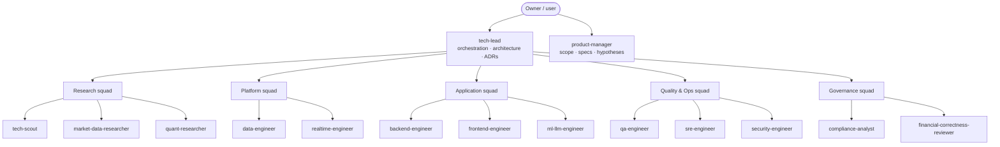

# 12 — Team Operating Model (human + Claude Code agents)

← [Index](README.md) · Related: [10 Claude Code setup](10-claude-code-setup.md) · [13 Quick-response system](13-quick-response-system.md)

This repository is set up as if it were built by a full software team. Each role exists as a **Claude Code subagent** in `.claude/agents/`. A role has:
- an area it owns;
- guardrails;
- a per-role memory. It defaults to `memory: local`, stored in `.claude/agent-memory-local/<role>/`, which git ignores. **The repository is public, so shared memory would publish vendor quotes and negotiation notes.** A private team can switch a role to `memory: project` (`.claude/agent-memory/<role>/`, tracked by git). Shared knowledge otherwise goes into reviewed docs and handoffs;
- for implementation roles, `isolation: worktree`, so parallel work doesn't collide.

Human team members can adopt the same roles. The agents then act as each person's assistant.

## 1. Org chart



## 2. Ownership map

| Role | Owns (target layout from [05](05-target-architecture.md)) | Reviews |
|---|---|---|
| tech-lead | `05`, `08`, `adr/`, cross-module interfaces | Everything that is integrated |
| product-manager | `02`, `09`, `specs/` | Scope of every feature |
| tech-scout | `research/*` (technology), `research/tech-radar.md` | New dependencies |
| market-data-researcher | `research/market-data.md`, `04` §6, vendor questions | Data-rights impact of features |
| quant-researcher | `06`, `research/papers.md`, `research/` (experiments) | Detector methodology |
| data-engineer | `marketdata/`, `calendar/`, `evidence/` (ingest), `domain/`, `migrations/`, legacy `src/adapters/` | Schema changes |
| realtime-engineer | `ingestor/`, `detector/` (runtime), `decision/`, `13` | Latency and concurrency |
| backend-engineer | `web/` (API), `notify/`, `ops/`, `main.py`, legacy `src/` | API contracts |
| frontend-engineer | `web/templates`, `web/static`, service worker | UX copy and accessibility |
| ml-llm-engineer | `summarizer/`, `evals/`, `prompts/` | Any LLM usage |
| qa-engineer | `tests/`, fixtures, replay datasets | Test adequacy of every change |
| sre-engineer | CI, `pyproject.toml`, containers, deploy config, `runbooks/`, SLOs | Operability |
| security-engineer | `07` §1–2, `guard_secrets.py` rules | Auth, secrets and input handling |
| compliance-analyst | `07` §7, `licence-register.md` | Copy, exports and data flows |
| financial-correctness-reviewer | — (read-only) | Every calculation or data change |

Path-scoped rules in `.claude/rules/` load automatically when files in these areas are read:

| Rule file | Covers |
|---|---|
| `market-data.md` | Market-data code |
| `realtime-decision.md` | The real-time decision path |
| `llm.md` | LLM code |
| `tests.md` | Tests |
| `docs.md` | Documentation |

## 3. RACI for common work

**R** = Responsible, **A** = Accountable, **C** = Consulted, **I** = Informed.

| Work type | R | A | C | I |
|---|---|---|---|---|
| New feature | Implementing role(s) | tech-lead | product-manager, qa-engineer, compliance-analyst | sre-engineer |
| New data source or vendor | data-engineer | tech-lead | market-data-researcher, compliance-analyst, security-engineer | product-manager |
| Detector or calculation change | data-engineer / realtime-engineer | tech-lead | quant-researcher, financial-correctness-reviewer (must approve) | qa-engineer |
| New technology or language | tech-scout → realtime/backend | tech-lead (ADR; user accepts) | sre-engineer, security-engineer | all |
| LLM prompt or model change | ml-llm-engineer | tech-lead | compliance-analyst, qa-engineer | product-manager |
| Release | sre-engineer | tech-lead (user approves deploy) | qa-engineer, security-engineer, compliance-analyst | all |
| Incident | sre-engineer | tech-lead | the owner of the affected area | user |

## 4. Standard workflow

`/team-kickoff <request>` runs this flow end to end:

1. **Intake.** product-manager maps the request to a hypothesis or workflow. tech-lead maps it to a `T-xx` task.
2. **Discover.** Research roles run in parallel, one front each (`/research-sprint`, or the saved `research-sprint` workflow for large sweeps).
3. **Decide.** tech-lead drafts an ADR (`/adr`) if the decision is durable. **The user accepts decisions that involve money, vendors, licences or a language change.**
4. **Plan.** `/plan-task T-xx`.
5. **Build.** Implementation roles work on disjoint paths in worktrees.
6. **Verify.**
   - qa-engineer runs tests.
   - financial-correctness-reviewer (`/financial-validation`) reviews data and calculation changes.
   - security-engineer reviews auth, secrets and input handling.
   - `/verify-change` runs last.
7. **Handoff.** `/handoff` writes a note to `docs/production-plan/handoffs/` and updates the receiving role's memory.
8. **Standup.** `/standup` at the start of each session.

**Definition of done (all roles):**
- acceptance criteria met;
- tests added and passing, with the exact commands shown;
- invariants preserved;
- docs and `CLAUDE.md` updated when commands or behaviour changed;
- handoff written;
- nothing pushed or deployed without the user.

## 5. Handoff format

```
## Handoff — <date> — <from role> → <to role>
Task: T-xx / <short name>
Done: <bullets with file paths>
Evidence: <commands run + results; tests added>
Not verified: <explicit list>
Decisions: <ADR links / reasoning>
Risks / open questions: <bullets>
Next steps: <numbered, each with owning role>
```

## 6. Two ways to run the team

| Mode | How | When | Notes |
|---|---|---|---|
| **Subagents** (default) | The main session (acting as tech-lead) delegates with the Agent tool, or with `/team-kickoff` | Most work | Stable. Subagents can nest up to 3 levels. Up to 20 run concurrently by default ([docs](https://code.claude.com/docs/en/sub-agents.md)). |
| **Agent teams** (experimental, opt-in) | Set `CLAUDE_CODE_EXPERIMENTAL_AGENT_TEAMS=1` in *your* `.claude/settings.local.json` `env`, then ask: "Spawn teammates using the data-engineer, qa-engineer and security-engineer agent types to …" | Long parallel efforts where teammates need to message each other and share a task list | Experimental. Start with 3–5 teammates. There are no nested teams. On Windows it runs in-process only (no split panes). A teammate gets the agent's `tools`, `model` and body, but **not** its `skills`, `memory`, `permissionMode` or `isolation` ([docs](https://code.claude.com/docs/en/agent-teams.md)). It is not enabled in the shared project settings, because token cost grows with the number of teammates. |
| **Workflows** | Ask for the saved `research-sprint` workflow with `args: {question, fronts?, constraints?}` | Broad, deterministic fan-out research with adversarial verification | **Cost:** with the default 6 fronts it runs up to about 67 agents (6 scouts + at most 5 candidates × 2 skeptics per front + 1 synthesis). Pass fewer `fronts` to shrink it. Whether saved workflows in `.claude/workflows/` are discovered has not been verified; the script can also be passed by path. |

## 7. Team rituals

| Cadence | Ritual | Tool |
|---|---|---|
| Each session | Standup | `/standup` |
| Each task | Plan → build → verify → handoff | `/plan-task`, `/verify-change`, `/handoff` |
| Weekly | Alert-quality audit (50 alerts); calibration drift; cost and quota review | quant-researcher, ml-llm-engineer, sre-engineer |
| Monthly | Tech-radar refresh; dependency and licence review; vendor-terms check | `/research-sprint`, compliance-analyst |
| Before a release | Readiness review | `/readiness-review` (manual only) |
