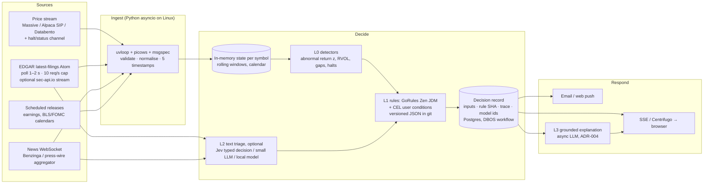

# 13 — Quick-Response System (fast fetch → decide → respond)

← [Index](README.md) · Related: [04 Real-time data](04-real-time-data-strategy.md) · [05 Architecture](05-target-architecture.md) · [12 Team](12-team-operating-model.md)

**Status: proposal (2026-09-24).** This responds to the owner's request for a quick fetch, response and decision system, with any language allowed.

Evidence comes from five research appendices (all accessed 2026-09-24, with per-claim confidence ratings):
- [low-latency](research/low-latency.md): runtimes, engines and latency tiers
- [fast-fetch](research/fast-fetch.md): feeds, protocols, client libraries, hosting and fan-out
- [decision-engines](research/decision-engines.md): rules, frameworks, ML, LLMs and audit
- [reactive-and-jev](research/reactive-and-jev.md): Jev, the Typesafe/Akka/Pekko family, and reactive alternatives
- [infrastructure](research/infrastructure.md)

Decisions: [ADR-006](adr/ADR-006-quick-response-tier-and-runtime.md), [ADR-007](adr/ADR-007-jev-as-optional-triage-classifier.md).

---

## 1. The key finding: physics and entitlements set the speed limit, not the language

| Leg | Typical latency | Source / confidence |
|---|---|---|
| Exchange → SIP consolidation | ~12–20 µs median | [low-latency](research/low-latency.md) (M) |
| Databento, direct cross-connect vs. internet | p90 42 µs vs. 590 µs | (M) |
| Massive (formerly Polygon) WebSocket, vendor's own runs | medians of 9 ms and 41 ms | (H) |
| AWS us-east-1 ↔ Secaucus/NY4, one way | ≈ 1.8–2 ms by fibre physics; 3–8 ms round trip reported | (L–M) |
| SEC EDGAR acceptance → Atom feed | seconds (≈ 25 s in one secondhand study); after-hours filings held to the next morning | [fast-fetch](research/fast-fetch.md) (M/L) |
| Server → browser (SSE/WebSocket) | tens to low hundreds of ms | (M) |
| Mobile push | provider accepts in ~65–110 ms; delivery to the device often 1–2 s, with no guarantee | (M) |
| **15-min delayed entitlement** (the pilot default in [ADR-002](adr/ADR-002-delayed-first-market-data.md)) | **900 s** | Exchange rules (H) |

**Implications:**
- Above about 1 ms, language choice barely matters. Network, the vendor, the entitlement and delivery dominate.
- Sub-millisecond end to end is impossible from any cloud region outside the NJ data-centre metro, and impossible over a retail WebSocket.
- With delayed prices, "quick response" is really about reacting to **evidence** within seconds: filings, news and halts, which can be fetched in real time and cheaply. Reacting to prices quickly needs the real-time entitlement from [04 §6](04-real-time-data-strategy.md#6-licensing-and-entitlements).

## 2. Latency tiers and the recommendation

| Tier | End-to-end target | Needs | Cost and team | Verdict |
|---|---|---|---|---|
| **A: about 1 s** | Event arrival to in-app alert: p95 ≤ 1 s for evidence events, and p95 ≤ 1 s after the bar or print is available for price events | Linux VM in US-East; vendor WebSocket(s); EDGAR poller; Python asyncio | 1–2 developers; ~$50–300/mo of infrastructure plus data (estimate) | **Adopt now** |
| B: 10–50 ms | Tick to decision in tens of ms | Hosting in the NJ metro or co-located with the feed (e.g. Databento), a Rust/JVM or Deephaven hot path, no LLM in the path, a real-time entitlement plus **non-display licence** if decisions are automated | Specialist developer; data and hosting in the $k/mo | Only if a paying use case needs it, e.g. automated execution, which is out of scope |
| C: sub-ms | Microseconds | Colocation (NY4/NY5, Carteret, Mahwah), direct exchange feeds, kernel bypass, C++/Rust/Java (Disruptor, Aeron) | $10k+/mo plus HFT specialists (estimate) | **Not appropriate** for this product |

## 3. Tier-A design

**Layering rules:**
- **L0 (detectors) and L1 (rules)** are deterministic. They run in microseconds to milliseconds in-process and can be replayed exactly. Every decision record stores:
  - the input snapshot;
  - `as_of_ts`;
  - the rule file's git SHA and the engine version;
  - the engine trace;
  - the output.

  Rules never read the clock, randomness or I/O.
- **L2 (text triage)** answers questions such as "Is this 8-K material?", "Which catalyst type?", "Does this headline concern this issuer?". Its answer can **raise priority or attach tags**. It can **never** set a price, size or limit, and it is never the sole trigger for anything consequential. It runs in parallel with L0/L1 with a timeout (for example 800 ms). On timeout, the rules proceed without it.
- **L3 (explanation)** is asynchronous and grounded, following ADR-004 and [06 §5](06-quantitative-validation.md#5-llm-explanations-evaluation). The alert ships first and the explanation follows.
- **Delivery.** In-app delivery uses SSE, or Centrifugo for history recovery on reconnect. Email and push are best-effort and are labelled as such. Per [fast-fetch](research/fast-fetch.md), SSE over HTTP/2 is within about 1 ms of WebSocket for server-to-client traffic.

**Latency budget, tier A** (proposal; measure it in Q-03):

| Stage | Budget p95 |
|---|---|
| Vendor → ingest (after the event is available to us) | 50–300 ms |
| Parse, validate, state update | ≤ 5 ms |
| L0 + L1 decisions | ≤ 5 ms |
| Persist the decision record (async commit / outbox) | ≤ 20 ms |
| Fan-out to an open browser | ≤ 250 ms |
| **Total, without L2** | **≤ ~600 ms** |
| L2 enrichment (parallel, with timeout) | +70–800 ms, and it may update the alert |

**Runtime notes:**
- uvloop does **not** run on Windows. Develop on WSL2 and deploy on Linux ([fast-fetch §3](research/fast-fetch.md)).
- `picows` is the fastest Python WebSocket client in its author's benchmark.
- `msgspec` Structs decode and validate faster than orjson.
- The official Databento client uses TCP/DBN with replay and snapshot support. Massive does not replay; fill gaps over REST.

## 4. "Jev" and similar tools

The owner asked for **Jev "from Typesafe"**.

- **What it is.** **Jev by TypeSafe AI** (typesafe.ai), released in early access on **2026-09-15**. It is a "System One" model: *"unstructured state in, typed probabilistic decisions out"*. It returns booleans, choices and scores with calibrated probabilities, and does no free-text generation.
- **Vendor claims.** End-to-end latency is **70–500 ms**. Pricing is **$0.042 per million input tokens, with output free** ([TypeSafe blog](https://typesafe.ai/blog/introducing-system-one-models-and-jev), fetched 2026-09-24; claims H as stated, performance not independently verified).
- **Access.**
  - The official Python SDK is **`typesafe-sdk`**: PyPI metadata read 2026-09-24 shows version 0.7.1, author "TypeSafe AI", homepage typesafe.ai, repo `typesafe-ai/typesafe-sdk-python`, uploaded 2026-09-21 (H).
  - The PyPI package **`jev`** (0.3.0) and the crates.io `jev` crate have no listed author or homepage. Treat them as **unofficial third-party** packages and do not install them.
  - Jev is also reported to be available via OpenRouter, AI/ML API and Pydantic AI ([TypeSafe docs](https://docs.typesafe.ai/introduction/coding-agents), [Pydantic docs](https://pydantic.dev/docs/ai/models/typesafe/), M).
- **What it is not.** It is unrelated to **Typesafe Inc.**, which became Lightbend and, in 2024, **Akka**. No Typesafe, Lightbend or Akka product named JEV was found ([reactive-and-jev](research/reactive-and-jev.md)).

**Fit:**
- A strong candidate for the **L2 text-triage** layer.
- **Not** a replacement for deterministic rules. The docs say it can't do arithmetic or dates. Its self-reported accuracy is about 68% on vendor evals against LLM-generated labels. It is a closed, hosted, waitlisted model.
- Its "calibrated probabilities" are used **internally** for routing and thresholds only. They are never shown to users as "confidence" (ADR-004).

**Blocking before product use:**
- review the terms and AUP, including financial or automated-decision use and data retention;
- add it to the subprocessor disclosure;
- confirm we may send licensed news text to a third party;
- confirm the serving region, SLA and rate limits.

Decision: [ADR-007](adr/ADR-007-jev-as-optional-triage-classifier.md), amended after a deeper review ([assistant-300ms-and-jev](research/assistant-300ms-and-jev.md)). That review found Jev is US-West only, has no SLA, forbids distillation, and has a 64k context and a 1,200 requests/min limit. **It is used for background tagging only, not on India live paths.** For the India 300 ms assistant, see [14](14-global-market-assistant.md).

**Similar tools, by the job they do:**

| Job | Options (see appendices for licence and version) |
|---|---|
| Fast typed text decisions (L2) | **Jev**; Claude Haiku 4.5 or Gemini 2.5 Flash-Lite with structured outputs; a local fine-tuned classifier (baseline); Groq or Cerebras for fast open-model inference (vendor-risk note: Groq/Nvidia) |
| Deterministic, explainable rules (L1) | **GoRules Zen + JDM** (MIT, Rust core, Python/JVM/Node bindings, v2.0.2); **CEL** (cel-python) for user conditions; Drools/KIE (DMN) for JVM teams; OPA/Cedar only for policy; Esper for CEP (GPLv2, caution) |
| Reactive runtime ("Typesafe family" and peers) | **Apache Pekko** (Apache-2.0 fork of Akka, 1.7.0) if JVM skills and clustering or event-sourcing are needed. **Akka** 3 (BSL 1.1; a production licence key is required). Vert.x, Reactor, Elixir OTP + Broadway, Rust tokio/Actix/Kameo, Python asyncio (default) |
| Incremental real-time analytics | **Deephaven** (Python front end, Java engine; 10–100 ms update cycles); Materialize CE; RisingWave; Feldera; Polars 2.0 / DuckDB for per-bar recompute. Avoid: Bytewax (company stopped; community-maintained) |
| Ultra-low-latency plumbing (tier B/C only) | LMAX Disruptor, Aeron, Chronicle, iceoryx2, NATS (≈ sub-ms core messaging) |
| Durable, auditable workflows | **DBOS** (MIT, Postgres-only, Python); Temporal (multi-service); Restate (BSL server) |
| Backtest → paper → live, same code (later only) | NautilusTrader 1.x with Interactive Brokers (v2 Rust is still an RC); LEAN with Alpaca/IBKR/Tradier |
| Fast ML inference | LightGBM/CatBoost + lleaves/Treelite/ONNX Runtime; River for drift. Time-series foundation models are weak for returns (negative out-of-sample R² reported) |
| Market-data MCP servers (research, not the hot path) | Massive, Alpha Vantage, Alpaca (can place trades, so never give it to agents), Financial Datasets, OpenBB |

The consolidated view is in the [tech radar](research/tech-radar.md).

## 5. Language and runtime decision

See [ADR-006](adr/ADR-006-quick-response-tier-and-runtime.md).
- **Python stays the default** for tier A. It matches team size, the quant and ML libraries, and the measured bottlenecks (network and vendor).
- **Rust via PyO3** comes in only for a profiled hot spot, for example full-market tick ingestion at more than about 10k msg/s. Zen already brings a Rust core in-process.
- **Pekko (Scala/Java)** only if the team has JVM skills **and** needs clustered per-symbol actors or event sourcing. Prefer it to Akka because of Akka's BSL licence.
- **Tier B or C** requires an approved use case, a benchmark on our workload, and new entitlements. Otherwise it is not done.

## 6. Quick-response track (tasks)

These tasks slot into [08](08-implementation-roadmap.md) alongside Stage 1–3.

| ID | Task | Owner | Accept when |
|---|---|---|---|
| Q-01 | Latency harness: 5-timestamp instrumentation, replay at 1× and 10× speed, p50/p95/p99 per stage | realtime-engineer + qa-engineer | Report produced from a recorded day |
| Q-02 | EDGAR fast poller: Atom feed every 1–2 s within 10 req/s, dedup by accession number, measured acceptance-to-ingest lag | data-engineer | 5 trading days of lag stats |
| Q-03 | Tier-A ingest prototype on Linux/WSL2: uvloop + picows + msgspec vs. httpx/websockets baseline on the chosen vendor, dev entitlement | realtime-engineer | Benchmark with methodology committed; p95 ingest ≤ 5 ms |
| Q-04 | Decision layer spike: Zen JDM rules in git, trace persisted, and replay reproduces identical decisions; CEL for user conditions | realtime-engineer + financial-correctness-reviewer | Replay of 1 recorded day gives 100% identical decision records |
| Q-05 | L2 bake-off on 500 labelled filings/headlines: Jev vs. Haiku/Flash-Lite structured output vs. a local classifier. Metrics: accuracy, calibration (Brier / reliability), p95 latency, cost | ml-llm-engineer + quant-researcher | Report meets ADR-007 criteria; **terms reviewed by compliance-analyst first** |
| Q-06 | In-app fan-out: SSE (or Centrifugo) with resume-after-reconnect; measured server → browser p95 | backend-engineer + frontend-engineer | p95 ≤ 250 ms on staging |

## 7. What would change this design

- **A validated, paying need for sub-second price reactions.** That means a real-time entitlement ($, [09 §3](09-costs-and-operating-model.md#3-real-time-upsell-economics-for-a-stage-6-decision)) and tier A with a real-time feed. It does not require tier B.
- **Automated execution entering scope.** Tier B, non-display licensing, and a broker and regulatory path ([05 §9](05-target-architecture.md#9-future-execution-separation-not-in-mvp)) would all be needed.
- **Jev failing Q-05, or unacceptable terms.** Use the LLM structured-output path or the local classifier. The architecture doesn't change, because L2 sits behind an interface.
