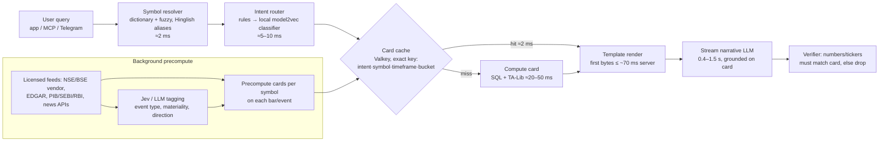

# 14 — Global & India Market Assistant ("300 ms daily assistant")

← [Index](README.md) · Related: [02 Thesis](02-product-thesis.md) · [13 Quick-response](13-quick-response-system.md) · [15 Finance-model layer](15-finance-model-layer.md) · [ADR-008](adr/ADR-008-india-first-market-assistant-scope.md)

**Status: proposal (2026-09-24). It needs the owner's decision on the open choices in §9.**

**The ask.** An assistant that TradingView, Bloomberg, Groww, Zerodha and Angel One users can use every day. It should:
- fetch news and details from around the world (sentiment, indicators, algos, deals, stock details, history);
- reply in about 300 ms;
- be very accurate, reliable and real.

**Evidence** (research appendices, all accessed 2026-09-24):
- [india-market-data-and-sebi](research/india-market-data-and-sebi.md)
- [global-news-and-data](research/global-news-and-data.md)
- [assistant-300ms-and-jev](research/assistant-300ms-and-jev.md)
- [distribution-and-competitors-india](research/distribution-and-competitors-india.md)
- [accuracy-indicators-algos](research/accuracy-indicators-algos.md)

---

## 1. Verdict in brief

| Want | Achievable? | How |
|---|---|---|
| **300 ms replies** | **Yes, for structured answers** from precomputed "answer cards" served in-region (Mumbai), measured server-side at p95. **No, for a full AI-written answer**: the fastest measured first-token time is ~0.3 s (Gemini 2.5 Flash-Lite, US-measured) and ~0.6 s (Claude Haiku 4.5). | Card first, then a streamed narrative (0.4–1.5 s), checked against the card |
| **Jev (TypeSafe)** | **Yes, off the live path** | Background tagging of news and filings (event type, materiality, direction, affected symbols). Not in the India live path: it is US-West-only (≈ 320–340 ms from India, estimated), English-first, has no SLA, and its terms forbid distilling its outputs into our own router |
| **All news worldwide** | **Headlines, snippets and links: yes. Full text or AI summaries: only from licensed sources.** | Aggregators (GDELT, NewsAPI.ai, Marketaux) cover discovery. Summary rights come only from licensed-content vendors (Benzinga for the US; Factiva / LSEG / HT Syndication / PTI by quote). Free sources: PIB, SEBI, RBI, SEC EDGAR |
| **Indian live prices** | **Only through an NSE/BSE-licensed feed** | Broker APIs (Kite etc.) **cannot** be redisplayed or cached across users. Kite's own terms say so. NSE tariffs for real-time display run from ~₹27.5 lakh/yr (open website) up to ~₹2.4 Cr/yr (per-user, 1,000 users, 2 segments). 15-min delayed data is ~₹60k per segment per channel. All NSE figures are M-confidence; NSE must confirm |
| **Deals** (bulk/block/insider/SAST) | Yes, from licensed vendors or exchange data products | Scraping NSE is barred by its terms. Deal files arrive **after market close**, so during market hours cards must say "not yet published" |
| **Indicators** | Yes, deterministic | TA-Lib as the reference. Pin one definition per indicator and golden-test it against broker/TradingView values (see §6) |
| **Sentiment** | As a **label of the text**, not a prediction | The evidence that sentiment predicts tradable returns is weak and decays; see [papers](research/papers.md) and [global-news §sentiment](research/global-news-and-data.md) |
| **Algos / signals** | **Education and backtests only**, unless registered | Recommendations, targets or signals need **SEBI Research Analyst registration**, even if the product is free (SEBI counts any economic benefit as consideration). Order placement falls under the retail algo framework (mandatory since 2026-04-01: exchange-approved algos, static IP, empanelled providers). Educational price data needs a 30-day lag from 2026-07-01 |
| **Inside TradingView / Bloomberg / brokers** | **Mostly not directly** | TradingView's terms make overlay extensions risky, and it ships its own AI Copilot. Bloomberg's App Portal is institutional. Brokers can't partner with unregistered advice givers. The **practical channel is MCP**: our server sits next to the user's own Zerodha / Upstox / Fyers MCP in Claude or ChatGPT. Plus our own web/mobile app and a Telegram bot. WhatsApp bans general-purpose AI assistants (since 2026-01-15) |
| **Beat competitors** | Hard on breadth | Free or cheap rivals already exist: Dhan Fuzz (cited, multilingual), Groww GR 1, Angel ARQ/Ask Angel, Perplexity (NSE/BSE), Trendlyne (deals), Screener AI, TradingView Copilot. Indian retail pays ~₹150–500/mo |

**So what is "real, accurate and reliable"?** Every number is computed by code from licensed, timestamped data. Every claim cites its source and time. The assistant says "not available" or "no catalyst found" rather than guessing. It never gives buy/sell calls unless the company registers.

## 2. Product options (owner to choose; see ADR-008)

| Option | What | Who pays | Pros | Cons |
|---|---|---|---|---|
| **A. India evidence assistant (recommended start)** | Information-only assistant for Indian listed companies. Cards for quote (delayed or licensed), indicators, filings and announcements, bulk/block/insider deals, shareholding, results calendar, news headlines and links. Cited Q&A. Delivered via MCP, web app, digest and Telegram | Pro-am traders and SEBI-registered RAs/analysts, who must disclose AI use and need an audit trail. Estimate ₹499–4,999/mo, unvalidated | Legal without registration; differentiated by evidence plus speed; a narrow data budget | Smaller market; free competitors exist |
| B. India + registered advice | Option A plus signals, targets and algo strategies | Mass retail | The feature set the owner described | Needs SEBI RA registration (and IA/algo empanelment for execution). Liability. Heavy compliance |
| C. Global multi-market assistant | India + US + global news, prices and fundamentals | Global retail | Largest scope | Licensing multiplies per market (NSE/BSE, CTA/UTP, others). Premium news is enterprise-priced. Unaffordable for a startup at first |
| D. Keep the 02 thesis (US evidence ledger) | As planned | US independent researchers | Already designed | Doesn't match the owner's India-first intent |

**Recommendation:** start with **A** and reuse the 02 engine: detectors, evidence ledger, grounding rules, quick-response layers. Keep US coverage (02) as a second leg on the same engine. Revisit B only after legal advice and demand evidence.

## 3. 300 ms architecture (India region)

**Latency budget** (p95, measured server-side at the Mumbai ingress; the mobile last mile is extra):

| Stage | Target |
|---|---|
| Ingress (keep-alive) | 5 ms |
| Symbol resolution | 2 ms |
| Intent routing | 5–10 ms |
| Card lookup (hit) / compute (miss) | 2 ms / 20–50 ms |
| First content sent | **≤ 120 ms (hit), ≤ 300 ms (miss)** |
| Narrative stream complete | 0.4–1.5 s |
| Verifier | < 5 ms |

**Components:**
- **Hosting:** AWS ap-south-1 or GCP asia-south1.
- **Cache:** Valkey (BSD licence; avoid the Redis 8 licence).
- **Analytics store:** Postgres / ClickHouse.
- **Vector search, if needed:** Turbopuffer has a Mumbai region (vendor p50 14 ms), or pgvector.
- **Narrative LLM:** Gemini 2.5 Flash-Lite first choice (Mumbai availability unverified), Claude Haiku 4.5 second.

**Rules that keep it fast and correct:**
- Exact-key cache only. Never reuse a semantically similar answer across symbols or time.
- Every card carries source, entitlement, `as_of` and freshness.
- A stale card is labelled, never served as live.

## 4. Data stack by stage (estimates; details in the appendices)

| Stage | India | Global / US | News | Cost (estimate) |
|---|---|---|---|---|
| Prototype (internal only) | One vendor API on an internal licence (TrueData / Global Datafeeds). Devs use their own broker APIs for themselves only | EDGAR, FRED, World Bank | GDELT, NewsAPI.ai ($90/mo) or Marketaux, PIB/SEBI/RBI | ₹5–30k/mo + ~$90–150/mo + LLM |
| Pilot (≈1,000 users) | NSE/BSE **15-min delayed** via vendor: ~₹60k × segments × channels, plus vendor fees. Licensed deals/announcements feed (NSE D&A or C-MOTS/Accord, quote). Real-time only once the NSE category is confirmed | Delayed US data per [04](04-real-time-data-strategy.md) if US is included | Benzinga (US), plus an Indian syndication quote (HT/PTI) for summaries; otherwise headline + link | Low lakhs/yr + vendor quotes |
| Scale (≈100k users) | Central licensed feed plus our own cache. Per-user NSE licensing (~₹98.6 Cr/segment/yr at 100k users) is **not viable**, so negotiate the open-website or app category, plus derived-data fees | Add markets only with a demand case | Factiva / LSEG / HT by quote | Quote-driven |

## 5. Regulatory posture (not legal advice; counsel required)

- **Default: information only.**
  - **Allowed:** licensed prices; computed values with their formulas; filings; deal records; news with text-sentiment labels.
  - **Never:** buy/sell/hold, targets, stop-losses, "top picks", signals, personalised advice, performance claims.
  - **Enforcement:** output guardrails (deny-list plus classifier) and logs.
- **Research Analyst regulations (2024 amendment).** AI-use disclosure and responsibility for AI output apply to registered RAs. This makes RAs a natural customer (audit trail).
- **Algos.** No order placement in the pilot. Backtests are educational only, under the [06 §7](06-quantitative-validation.md#7-evidence-required-before-later-features-ship) evidence standards. Honest disclosure of SEBI's F&O loss statistics.
- **Privacy.** DPDP Rules 2025: consent-manager provisions from ~2026-11-13; full obligations from ~2027-05-13.
- **Data.** No scraping of NSE/BSE or broker data. Respect X's ban on training models with its content, and its 24-hour deletion rule.

## 6. Accuracy and reliability

See [accuracy-indicators-algos](research/accuracy-indicators-algos.md) and [06](06-quantitative-validation.md).

- **Canonical indicators.** No platform-neutral "correct" RSI, EMA, ATR or Supertrend exists: TradingView, Kite and TA-Lib differ in seeding, smoothing and warm-up. So we publish **our own versioned specification**:
  - Wilder RSI, with a defined flat-window case;
  - SMA-seeded EMA, plus a `tv_compat` mode that matches TradingView;
  - session-anchored VWAP, never computed on indices;
  - Black-76 Greeks, using MIBOR as the rate.

  **Comparisons against other platforms are made only after warm-up.** For a 14-period indicator that is ≥ 125 bars for RSI/ATR and ≥ 65 for EMA.
- **Fixtures.** Hand-computed values are reproducible with [fixtures/indicator_fixtures_check.py](research/fixtures/indicator_fixtures_check.py), a standard-library-only script. They are the first golden tests (task I-05).
- **Indian market rules are dated data, not constants.** Examples:
  - one weekly-expiry index per exchange (2024-11-20);
  - NSE expiry on Tuesday and BSE on Thursday (2025-09-01);
  - F&O pre-open (2025-12-08);
  - lot-size cuts (Jan 2026 series);
  - closing auction setting the official close (2026-08-03);
  - new pre-open phases (2026-09-07).

  Each one needs a fixture ([accuracy §2](research/accuracy-indicators-algos.md)).
- **Honest claims.**
  - Show SEBI's dated loss statistics: 91% of individual F&O traders lost money in FY25 (July 2025 study). A 2026 study reports 87.7% for FY26 (secondary sources).
  - Never claim "accurate signals", win rates or "AI predicts".
  - Performance claims require PaRRVA verification.
- **Options analytics** (PCR, OI, max-pain, Greeks) come from a licensed F&O feed. The model choice (Black-76 for index options) is stated, and IV is labelled as model-derived. Expiry-day conventions follow the current NSE/BSE schedules.
- **Numeric grounding.** The LLM receives only the card. The verifier rejects any number or ticker not present in it. The assistant abstains when data is missing or stale.
- **Evaluation.**
  - A golden set of ≥ 300 real queries, including Hinglish.
  - IndiaFinBench and FinanceBench-style checks.
  - Citation precision, numeric exact-match, abstention correctness, and p95 latency per intent, run in CI.
- **Reliability.**
  - A per-feed freshness SLO.
  - Degraded-mode banners ([04 §5](04-real-time-data-strategy.md#5-freshness-and-degraded-mode-semantics)).
  - Holiday and circuit/halt handling.
  - ISIN / symbol-change mapping.

## 7. Distribution (ranked)

1. **Our own remote MCP server**, listed in the Claude connectors and ChatGPT apps directories. It works alongside the user's broker MCP (Zerodha / Upstox / Fyers official).
2. **Web app** plus email digest and web push.
3. **Telegram bot**, kept clearly non-advisory.
4. **Browser extension on broker web apps**: medium ToS risk.
5. **TradingView overlay**: high ToS risk, and TradingView ships its own Copilot.
6. **WhatsApp**: alerts and digests only, because of its ban on general AI assistants.
7. **Broker partnerships**: only if we are registered or strictly information-only.

## 8. Plan changes

- **New ADR:** [ADR-008](adr/ADR-008-india-first-market-assistant-scope.md) (proposed). It supersedes the US-only assumption in [02](02-product-thesis.md) and [11](11-evidence-and-open-questions.md) if the owner accepts it.
- **New tasks** (added to [08](08-implementation-roadmap.md)):

| Task | Description | Owner(s) |
|---|---|---|
| I-01 | NSE/BSE and vendor licence questions sent and answered | market-data-researcher → owner |
| I-02 | Counsel memo on RA/IA and the information-only guardrails | compliance-analyst → owner |
| I-03 | Card schema, and the symbol master (NSE/BSE codes, ISIN, aliases including Hinglish) | data-engineer |
| I-04 | Intent router and card cache prototype in Mumbai, with a latency harness (p95 ≤ 120 ms hit) | realtime-engineer |
| I-05 | Canonical indicator spec and golden tests | quant-researcher + qa-engineer |
| I-06 | MCP server prototype (read-only evidence tools) | backend-engineer |
| I-07 | Q-05 bake-off extended to Hinglish; Jev for background tagging only | ml-llm-engineer |
| I-08 | 12–15 interviews with Indian pro-am traders and RAs, plus a fake-door pricing test in ₹ | product-manager |

## 9. Decisions needed from the owner

1. **Scope:** A (recommended), B, C or D? Or A plus the US leg?
2. **Signals and algos:** out (information-only), or in with SEBI RA registration?
3. **"300 ms" definition:** first useful content at p95 server-side (recommended), versus full AI answer?
4. **Price data:** delayed plus licensed, or pay for real-time NSE display (category to be confirmed with NSE)?
5. **Budget envelope** for the pilot data licences.
