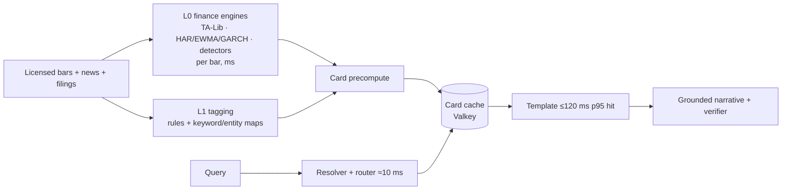
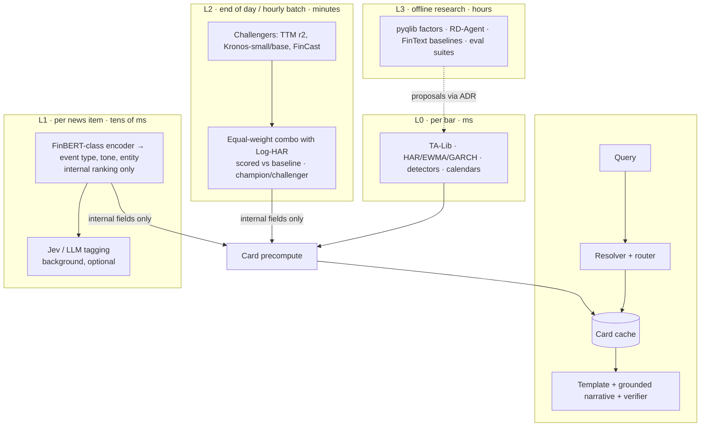

# 15 — Finance-Specialised Model Layer (Kronos and peers)

← [Index](README.md) · Related: [13 Quick-response](13-quick-response-system.md) · [14 Market assistant](14-global-market-assistant.md) · [06 Quant validation](06-quantitative-validation.md) · [ADR-009](adr/ADR-009-finance-model-layer.md)

**Status: proposal (2026-09-24). It needs the owner's decision on §9.**

**The ask.** Check [Kronos](https://github.com/shiyu-coder/Kronos) and find similar finance-specialised tools. The owner prefers finance-specialised components over general AI models, combined in several ways for the best response. That can be a multi-layer design or a simple one built for speed.

**Evidence.** Two research appendices, all sources accessed 2026-09-24:
- [finance-models-catalogue](research/finance-models-catalogue.md) (tech-scout): about 50 models, toolkits and benchmarks, with licences and India coverage.
- [finance-models-evidence](research/finance-models-evidence.md) (quant-researcher): the Kronos paper, independent replications, time-series FM studies, and the regulatory constraints.

Where the two differ, **the evidence appendix governs**. The catalogue ranked Kronos as the lead forecasting feature before the negative post-cutoff NSE replication was taken into account.

---

## 1. Verdict in brief

1. **The finance-specialised components with proven value are the deterministic engines.** They should be adopted now:
   - **TA-Lib** for indicators.
   - **HAR / Log-HAR, EWMA and GARCH-t** for volatility.
   - **exchange_calendars** for sessions.

   **skfolio** (risk) and **pyqlib Alpha158** (a research factor library) go to Trial alongside them (§4).

   They are fast (sub-millisecond to milliseconds), reproducible and licence-clean. They fit the 300 ms card path in [14 §3](14-global-market-assistant.md#3-300-ms-architecture-india-region).
2. **Kronos is real, open (MIT code and mini/small/base weights), and its training data includes NSE and BSE.** It has **not** shown that it can predict returns in a way users can act on:
   - **Tiny absolute values.** The headline "+93% RankIC" rests on correlations of about 0.02–0.07.
   - **Closed model.** Those headline numbers come from the closed Kronos-large.
   - **Three independent post-cutoff checks are negative.** Each is a single, unreviewed study (confidence M): a pre-registered repo and two GitHub issues.
     - NSE: its 80% intervals covered only 41.3% of outcomes (random walk: 83.7%).
     - AAPL: it did worse than a simple "no change" forecast.
     - BTC and gold: its direction calls were at chance level.

   **Place it in Assess**, as an *offline volatility challenger* to Log-HAR. It is not a forecasting feature.
3. **The one evidence-backed "combination" found** is the equal-weight **TTM r2 + Log-HAR** volatility ensemble. In [Brini 2026](https://arxiv.org/abs/2607.05291) it ranked among the statistically best models (the Model Confidence Set) for 98–100% of 50 assets. This is the pattern we want: *a finance baseline plus a specialised model, combined and scored against the baseline*. A stack of models voting on a prediction is not.
4. **Nothing generative runs on the 300 ms path.** Kronos, FinCast and LLMs run in batch or at end of day, and write their results into the card store.
5. **No forecast, target, confidence or sentiment score is ever shown to users.** This is CLAUDE.md invariant 5, SEBI Research Analyst (RA) rules plus the PaRRVA performance-verification regime, and FINRA 2210 in the US.
   - L1 and L2 outputs are **internal-only fields**: never rendered, used only for news ranking, routing and alert-threshold scaling.
   - Numbers shown on cards come from L0 deterministic engines only.
   - If a gated ensemble ever replaces an L0 estimate, that needs its own ADR.

## 2. Kronos: the facts that matter (details in the [evidence appendix §1](research/finance-models-evidence.md#1-kronos-the-facts))

| Item | Finding | Conf. |
|---|---|---|
| What it is | A foundation model for OHLCV candles. A tokenizer quantises the candles, then a decoder-only Transformer generates the next ones. It outputs sampled future OHLCV paths. | H |
| Paper | arXiv 2508.02739, AAAI 2026 | H |
| Sizes | mini 4.1M, small 24.7M, base 102.3M (all MIT on Hugging Face, not updated since 2025-09). Large, 499.2M, is **closed**. | H |
| Training data | 12.1B bars from over 40 exchanges, up to 2024-06. **NSE (2,554 assets) and BSE (5,491 assets) from 2020-01-31**, and NYSE/Nasdaq from 2000. The data vendor is **not disclosed**. | H |
| Contamination window | Any evaluation on NSE, BSE or US data before **2024-07-01** is contaminated. That leaves about 540 clean sessions. | H |
| "IC ≈ 0.063 on XNSE" | This is **path correlation within one series** (predicted vs actual OHLC path), **not cross-sectional return IC**. It is not an edge. | H (definition), M (value) |
| Only trading test | China A-shares, 0.15% cost per trade. No significance test, no deflated Sharpe, no India or US test. | H |
| Operational | No PyPI package (`kronos` on PyPI is an unrelated 2011 project), so pin a GitHub commit. Sampling is stochastic. Open issues: #403 (hangs on Windows), #252 (inference reshape bug), #52 (online demo doesn't match offline results). | H |

## 3. What finance-specialised models do and don't do (evidence summary)

| Use | Evidence | Verdict for us |
|---|---|---|
| Predicting return or direction | Rahimikia et al. (94 countries): every out-of-sample R² is negative. Noguer i Alonso: 2 of about 50 model–asset pairs are significant, which chance alone would produce. Kronos replications are negative. FINSABER: LLM-agent advantages vanish over 20 years. | **Never**, internally or for users, until the §6(a) protocol in the evidence appendix passes *and* counsel signs off |
| Volatility / risk | Log-HAR is hard to beat. Only TTM (tiny) beats it, narrowly. TTM + Log-HAR equal-weight is the robust choice. Kronos-vs-GARCH on NSE: −2.6% MAE, no significance test. | **Adopt** HAR, EWMA and GARCH. **Trial** TTM + Log-HAR. **Assess** Kronos as a challenger |
| Anomaly / regime flags | Deterministic detectors, calibrated to a target false-alert rate, already exist in the plan ([06](06-quantitative-validation.md)) | **Adopt** deterministic; FM output only as an extra internal feature after it passes the gates |
| News sentiment / event tagging | FinBERT family is the de-facto baseline. No credible India or Hindi model exists; one "Indian FinBERT" was trained on a US dataset. | **Trial** as *internal* tagging and ranking; fine-tune our own English + Hindi encoder later |
| QA over filings or regulations | Finance LLMs (Fin-R1, DianJin, Palmyra-Fin) are self-benchmarked, Chinese-centric, or non-commercial | General LLM + retrieval, **gated** by FinQA, BizBench and IndiaFinBench |
| Synthetic data / stress | GARCH-t, block bootstrap and regime-switching models cover test fixtures. FM outputs have unknown data provenance. | Classical generators; FMs are research only |
| Market simulation (MarS, TRADES) | Needs order-level (L3) data we don't have. Trained on China/US order books. | **Hold** |

## 4. Model and tool selection

"Where" refers to the layers in §5. "Gate" is what must pass before a component moves up a ring.

| Component | Task | Where | Ring | Licence (code / weights / data) | Gate to promote |
|---|---|---|---|---|---|
| **TA-Lib 0.8.x** | Indicators | L0 | **Adopt** | BSD | Golden fixtures ([accuracy appendix](research/accuracy-indicators-algos.md)) |
| **HAR / Log-HAR, EWMA (λ=0.94), GARCH(1,1)-t** (statsmodels/arch) | Volatility, risk bands, abnormal-move scaling | L0 | **Adopt** | BSD / NCSA | Out-of-sample QLIKE vs realised; financial-correctness review |
| **exchange_calendars** | Sessions and holidays (XNYS, XBOM; the library has no XNSE calendar) | L0 | **Adopt** | Apache-2.0 | NSE holiday and special-session list reconciled against NSE circulars |
| **skfolio 1.3.x** | Portfolio and watchlist risk (CVaR, HRP) | L0/L2 | **Trial** | BSD-3 | Fixture tests vs a reference implementation |
| **IBM TTM r2** | Volatility challenger; equal-weight with Log-HAR | L2 | **Trial** | Apache-2.0 | §6 challenger gate |
| **FinBERT family** (finbert-tone; ProsusAI) | Headline and filing tone → *internal* ranking | L1 | **Trial (internal only)** | Apache code; finbert-tone HF card has **no licence tag**; ProsusAI was trained on Financial PhraseBank, **CC-BY-NC-SA** → internal baseline only | Labelled India set; macro-F1 vs baseline; licence cleared |
| **Own English + Hindi finance encoder** | Product sentiment and event tagging | L1 | **Assess** | Ours; seed set `zeroshot/twitter-financial-news-sentiment` (MIT) | Labelled data; beats FinBERT |
| **Kronos-small/base** | Volatility or regime challenger | L2 | **Assess** | MIT / MIT / **unknown provenance** | §6 challenger gate; on data from 2024-07 onward only |
| **FinCast** (1B, Apache) | Same as Kronos | L2 | **Assess** | Apache-2.0 | Weights load; India transfer; §6 gate |
| **FinText TSFMs** | Year-vintaged checkpoints with no look-ahead, used as evaluation baselines | L3 | **Assess** | Apache-2.0 | — |
| **pyqlib 0.9.7** (`qlib` on PyPI is a look-alike) | Factor research, Alpha158, backtest harness | L3 | **Trial (research)** | MIT; **Yahoo `region IN` collector barred from product (invariant 7)** | Research only |
| **RD-Agent 1.0** | LLM-driven factor research | L3 | **Assess** | MIT | Research only; FINSABER-style evaluation |
| TradingAgents (GitHub; PyPI `tradingagents` is a third-party look-alike) | Reference only; it integrates Jev for post screening | — | **Assess** | Apache-2.0 | Never in the product path (trading agent) |
| Fin-R1, DianJin-R1 | Filing QA self-host option | L3 | **Assess** | Fin-R1 has no LICENSE file; DianJin is MIT | IndiaFinBench/FinQA vs general LLM |
| OpenBB | Data connectors | — | **Hold** | **AGPL-3.0** | — |
| vectorbt | Backtests | — | **Hold (product)** | **Commons Clause** | — |
| Moirai-2.0, Palmyra-Fin, FinanceBench (as training data) | — | — | **Hold** | **Non-commercial** | — |
| MarS, TRADES, LOBS5 | Order-book simulation | — | **Hold** | MIT, but needs L3 data | — |
| FinGPT-Forecaster | Direction signal | — | **Hold** | Llama base terms | — |

## 5. Two architectures

### Option S: simple and fast (recommended for the pilot)

Only deterministic finance engines produce numbers. The card path is unchanged from doc 14.

- **Pros:** reproducible, sub-100 ms card compute, licence-clean, easy to review, and within the SEBI information-only posture.
- **Cons:** no learned tagging, so news ranking is cruder.

### Option L: layered specialists (target, added layer by layer behind gates)

**Latency budget.** L1 and L2 figures are estimates, to be measured in the task F-03 harness:

| Layer | Trigger | Budget | On the 300 ms path? |
|---|---|---|---|
| Live card path | User query | ≤ 120 ms p95 hit / ≤ 300 ms miss ([14 §3](14-global-market-assistant.md#3-300-ms-architecture-india-region)) | Yes |
| L0 engines | Bar close / event | < 50 ms per symbol for all indicators and volatility (estimate) | No (precompute) |
| L1 tagging | News or filing arrival | Tens of ms per item on CPU for a BERT-base encoder (estimate, unmeasured) | No |
| L2 challengers | End of day or hourly | Minutes per universe; autoregressive sampling; fixed seeds and ensemble size | No |
| L3 research | Manual | Hours | No |

### How "combining for the best response" works

- **Combine inside a layer, score against the finance baseline.** Example: equal-weight TTM + Log-HAR volatility. A combination ships only if it lands in the Model Confidence Set (the statistically best-model set) and beats Log-HAR on QLIKE, a standard volatility-forecast loss. The test is Diebold–Mariano, with p < 0.05 after Holm correction, in *both* India and the US ([evidence §6(b)](research/finance-models-evidence.md#b-internal-features-for-volatility-regime-and-anomaly-detection-later-as-a-challenger-only)).
- **Champion/challenger.** The champion (Log-HAR) serves. Challengers run in shadow on data from 2024-07 onward, with a pre-registered split. Promotion is an ADR, not a config flag.
- **Combine across layers only through the card record.** L0 numbers are the only *displayed* fields. L1 tags and L2 regime flags are stored on the same timestamped record as **internal-only** fields. They may reorder news, choose which card to show, or scale alert thresholds, but they are never rendered or passed to the narrative LLM. The verifier drops any number not in the displayed fields.
- **Disagreement is logged, not shown.** When L2 flags disagree with L0, the disagreement is logged for the challenger study. Users never see a model confidence or an averaged score.

## 6. Hard rules for this layer

1. No user-facing forecasts, price targets, probabilities or sentiment scores (invariant 5; SEBI RA rules and PaRRVA; FINRA 2210).
2. Nothing stochastic or generative on the live path. Record the seed, the ensemble size, and the model commit/hash on every precomputed field.
3. Every evaluation starts on or after **2024-07-01** for Kronos (its pretraining cutoff), and after each other model's own training cutoff. Where a model's cutoff is unknown (TTM, FinCast), treat the whole period as contaminated until the cutoff is established. Log the start date in the experiment manifest.
4. Model licence ≠ data rights. For every component, record the code, weights and training-data licences. Kronos's training data has unknown provenance, so it is research-only until counsel clears it.
5. Fine-tuning on NSE/BSE bars needs a licence that permits model training ([india-market-data-and-sebi](research/india-market-data-and-sebi.md)). Yahoo-sourced data (Qlib `region IN`, `.NS`) is research-only.
6. Pin GitHub commits for Kronos. Install `pyqlib`, not `qlib`, and TradingAgents from GitHub, not PyPI. tech-scout checks metadata before any install, and the owner approves it.
7. Changes to calculation code go to `financial-correctness-reviewer`. Model changes go through the offline evaluation harness ([06 §5](06-quantitative-validation.md)).

## 7. Risks

| Risk | Mitigation |
|---|---|
| Owner expectation that a "finance AI" predicts prices | This doc plus ADR-009 state it plainly. Cards show deterministic volatility and indicator context, never direction. |
| Too few clean sessions (about 540) for any Sharpe claim | Don't make Sharpe claims. Volatility tests need far fewer sessions than return tests. |
| NSE price bands cap High/Low and bias range-based volatility estimates | Flag or exclude circuit-hit days (evidence §6(b)) |
| Kronos stability on Windows (#403), stochastic output | Linux batch workers, fixed seeds, timeouts; the card falls back to the L0 value |
| Licence drift (NC weights, missing LICENSE files) | Licence check in `/readiness-review`; the radar's Hold list |

## 8. Plan changes (proposed tasks, added to [08](08-implementation-roadmap.md) on acceptance)

| Task | Description | Owner(s) |
|---|---|---|
| F-01 | Volatility baseline module: EWMA, GARCH-t, HAR/Log-HAR on raw + corporate-action-adjusted bars, with golden fixtures | quant-researcher → data-engineer; financial-correctness-reviewer |
| F-02 | Pre-registered volatility challenger study: TTM r2, Kronos-small/base vs Log-HAR on data from 2024-07 onward, NSE + US, QLIKE/DM/MCS | quant-researcher |
| F-03 | L1 tagging spike: FinBERT-class encoder CPU latency and macro-F1 on 500 labelled India headlines (English + Hindi) | ml-llm-engineer |
| F-04 | Licence register for models and datasets (code / weights / training data) | compliance-analyst + security-engineer |
| F-05 | Internal-only card-record fields (never rendered) for L1 tags and L2 flags, with model provenance (seed, commit, as_of), and a test proving they never reach the UI or the LLM prompt | data-engineer + qa-engineer |
| F-06 | Research sandbox: pyqlib Alpha158 on licensed data only, no product path | quant-researcher |

Stage 0 blockers still come first: key rotation, and the NSE/vendor licence answers.

## 9. Decisions needed from the owner

1. **Architecture:** Option S for the pilot and Option L added behind gates (recommended), or Option L from the start?
2. **Kronos:** accept "Assess, volatility challenger only", or fund F-02 now?
3. **Sentiment:** accept internal-only use (no score shown to users), and a budget for a labelled English + Hindi India headline set?
4. **Model-training rights:** include "may we train and fine-tune on this data?" in the NSE and vendor questions (I-01)?
